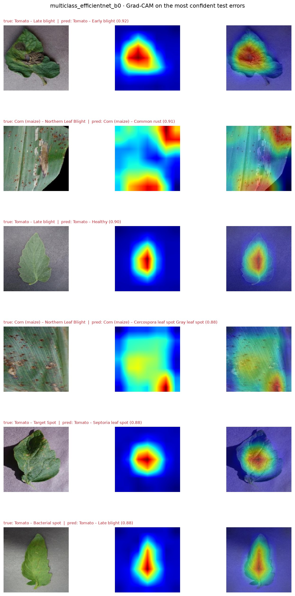
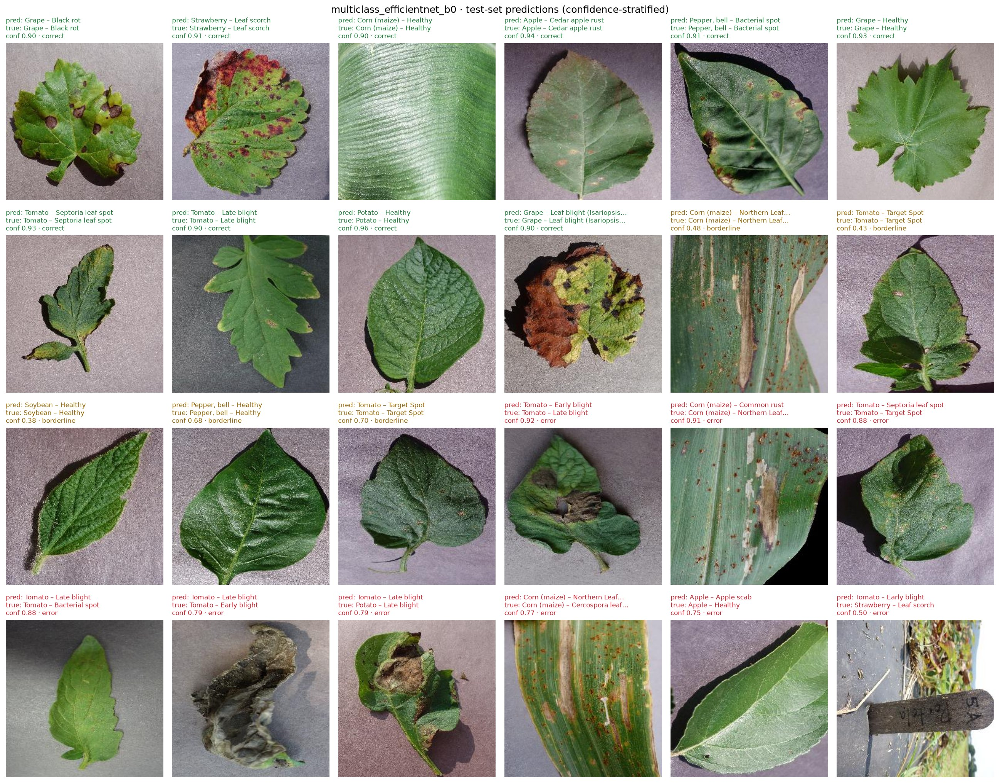

# Plant disease classification from leaf images

[](https://github.com/atilimai/plant-ai-project/actions/workflows/tests.yml)
[](LICENSE)
[](LICENSING.md)

Leaf disease classifiers trained on PlantVillage, with the part that usually goes wrong done
properly: **the train/validation/test split is made at the level of the physical leaf, and the
absence of leakage is audited and re-checked on every push.**

| Task | Classes | Test accuracy | Macro-F1 |
|---|---|---:|---:|
| Disease identification | 38 (14 crops) | **0.9952** | 0.9938 |
| Healthy vs diseased | 2 | **0.9986** | 0.9982 |

Best model per task, EfficientNet-B0 and MobileNetV2, on 7,770 held-out images.
Full tables: [`artifacts/reports/summary.md`](artifacts/reports/summary.md) ·
Analysis: [`docs/results.md`](docs/results.md) · Model card: [`MODEL_CARD.md`](MODEL_CARD.md)

---

## Why the split matters more than the architecture

PlantVillage contains several photographs of every physical leaf — different angles, re-shoots,
crops of one frame, and in one class a time series over several days. Split those by image and
almost every test picture has a sibling from the same leaf in training, so the test set mostly
measures whether the model recognises leaves it has already seen.

Measured on the images whose leaf identity the dataset authors published:

| Split strategy | Test images whose leaf is also in training |
|---|---:|
| Random split by image | 99.8% |
| Stratified split by image | 99.4% |
| Split this repository used before the rework | 99.98% |
| **Leaf-level split used here** | **0%** (audited) |

The published leaf map covers 41,111 of 54,305 colour images. For the remaining 13,194 we cut each
camera sequence into contiguous segments and drop held-out frames within 20 frame numbers of another
split; that buffer was chosen by simulating the rule on the images that *do* have leaf ids, where
the residual leakage can be measured (it is ≈0). The policy, the calibration table and the audit
are in [`data/splits/README.md`](data/splits/README.md).

This is also why these numbers should **not** be compared with the 99%+ figures usually quoted for
PlantVillage: those are almost always image-level splits.

## The result that matters more than the accuracy

The dataset ships a background-removed copy of almost every photo, so the same test images can be
re-run with the background changed and the leaf untouched:

| Test images | 38-class accuracy |
|---|---:|
| Original photographs | 0.9952 |
| Leaf on a flat lab-coloured background | 0.8430 |
| Leaf on black (dataset's segmented copy) | 0.8028 |

Disease identification loses 13–15 points the moment the background is replaced. A probe trained on
**background pixels alone** — leaf masked out, 16 colour statistics, logistic regression — predicts
the class 33.5% of the time against a 2.6% chance rate, because each class was largely photographed
in one session. Meanwhile Grad-CAM puts about 90% of its mass on the leaf:



A tidy saliency map is not evidence of robustness. The three experiments are worked through in
[`docs/results.md`](docs/results.md).

## Quick start

```bash
git clone https://github.com/atilimai/plant-ai-project && cd plant-ai-project
python -m venv .venv && .venv/Scripts/activate       # Linux/macOS: source .venv/bin/activate
pip install -r requirements.txt

python -m src.data.prepare --config configs/data.yaml   # download (2.2 GB), group, split, audit
python scripts/run_experiments.py                       # train, evaluate, analyse, export
```

Classify an image with a trained model:

```bash
python -m src.inference.predict --model models/exported/multiclass_efficientnet_b0 leaf.jpg
# leaf.jpg: Grape – Black rot (88.8%) | then: Potato – Healthy 0.8%, Apple – Cedar apple rust 0.6%
```

Or open the demo, which shows the top-5 predictions and the Grad-CAM overlay side by side:

```bash
python app/app.py
```

Training takes 11–24 minutes per run on an RTX 4060 Laptop GPU and resumes from the last checkpoint,
which matters on Colab: re-running the same command after a disconnect continues where it stopped.

## Notebooks

Five Colab-ready notebooks in [`notebooks/`](notebooks/), thin on purpose — the logic lives in
`src/`, so a notebook cannot drift from what the scripts do.

| Notebook | What it shows |
|---|---|
| `00_dataset_inspection` | Download and checksums, class distribution, leaf grouping, the split and its audit, augmentation check |
| `01_binary_experiment_plan` | Healthy vs diseased: config, training, learning curves |
| `02_multiclass_experiment_plan` | 38 classes: config, training, learning curves |
| `03_evaluation_plan` | Test metrics, confusion matrices, calibration, Grad-CAM, failure analysis |
| `04_demo_plan` | Inference from an exported model, Grad-CAM, prediction gallery |

Long-running cells sit behind a flag, so opening a notebook never starts a training run by accident.

## Sample predictions

Confidence-stratified, not cherry-picked: confident hits, borderline hits, and the most confident
mistakes, all from the held-out split.



## Repository layout

```
configs/            data.yaml (source, grouping, split policy) and one YAML per experiment
src/data/           download, leaf grouping, splitting, audit, dataset, transforms
src/models/         MobileNetV2 / EfficientNet-B0 wrappers and the Grad-CAM target layer
src/training/       resumable training loop (AMP, cosine schedule, early stopping)
src/evaluation/     metrics, evaluation runner, failure analysis, summary tables
src/visualization/  confusion matrices, Grad-CAM, galleries, calibration plots
src/inference/      predictor, safetensors/ONNX export, CLI
scripts/            run_experiments, audit_manifest, background_probe, build_hf_release, check_release
data/splits/        committed manifest and audit (no images)
artifacts/          metrics, figures and galleries produced by the pipeline
app/                Gradio demo, also packaged as a Hugging Face Space
```

## What is checked automatically

```bash
ruff check src tests scripts app     # style
pytest                               # 36 unit tests, no dataset or GPU needed
python scripts/audit_manifest.py     # leakage audit, from the committed manifest alone
python scripts/check_release.py      # 50 checks on the release claims
```

The first three run in CI on every push. `src.evaluation.evaluate` refuses to report test-set
metrics unless the committed audit says it passed, and `check_release.py` verifies that the numbers
quoted in the model card are the ones in `artifacts/`, that no dataset file or weight is committed,
and that no documentation link is broken.

## Limitations

* Every image is a single detached leaf on a uniform background under even lighting. Field
  performance is **unknown and expected to be much lower**; there is no field data here to check it
  with, and the background experiments above are a reason to be cautious rather than optimistic.
* Results come from one split, so per-class F1 for small classes (Potato healthy: 24 test images)
  carries wide uncertainty. Leaf-grouped cross-validation is in [`ROADMAP.md`](ROADMAP.md).
* The models answer with one of 38 classes for any input, and confidence is not an
  out-of-distribution signal. They are also underconfident by design (label smoothing): useful for
  ranking, not as a probability.
* One label per image — mixed infections, disease stage and severity are not represented.
* Research prototype. Not a diagnostic tool and not a substitute for an agronomist.

## History

This repository was taken over half-finished. The inherited split leaked, the reported metrics were
computed on images the model had trained on, and the committed figures had been generated from
random noise. What was found, how it was verified and what was removed is written down in
[`docs/previous_state_audit.md`](docs/previous_state_audit.md); the earlier state remains in git
history.

## Licence and citation

Code is GPL-2.0-only. PlantVillage images are CC BY-SA 3.0, and the dataset authors state that
algorithms trained on the data fall under the same licence, so the released weights are CC BY-SA 3.0
as well. Details in [`LICENSING.md`](LICENSING.md); please cite the dataset papers listed in
[`CITATION.md`](CITATION.md).

## Contributing

See [`CONTRIBUTING.md`](CONTRIBUTING.md). The short version: splits stay at the leaf level, reported
numbers come from the pipeline, and no figure enters `artifacts/` unless a real model produced it.
